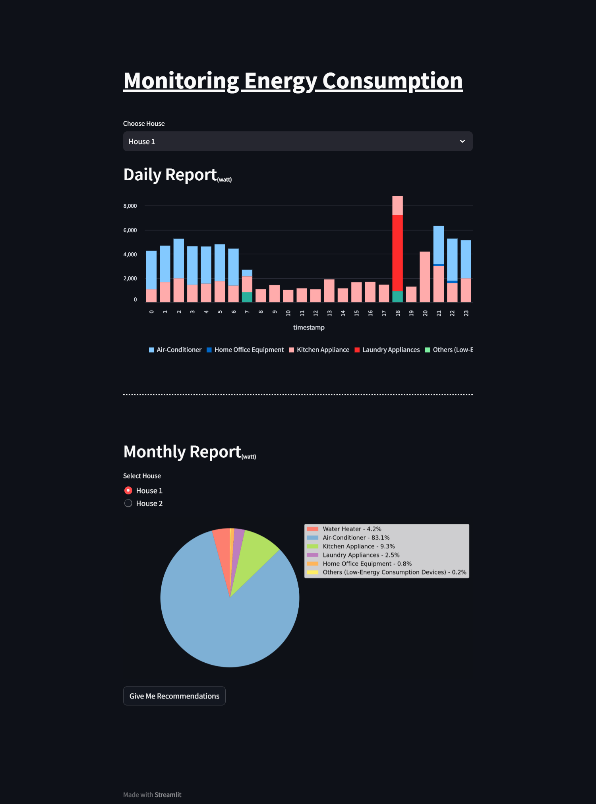
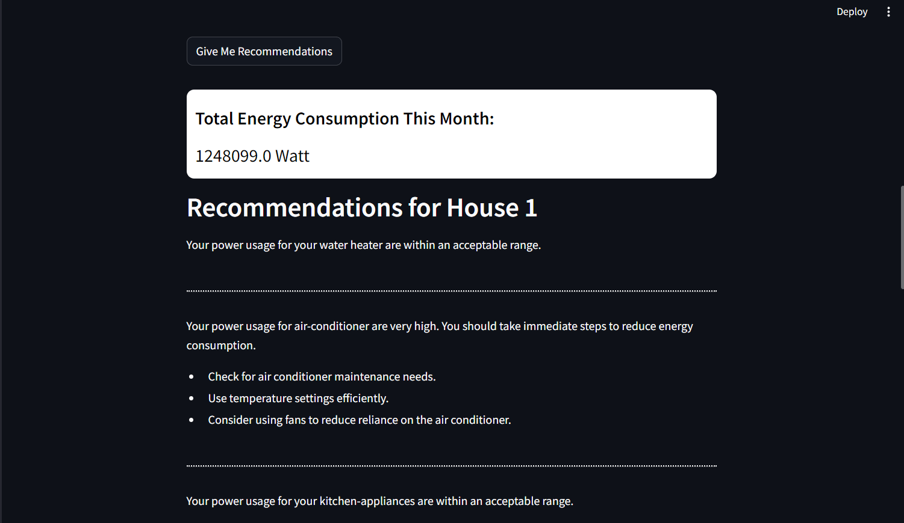
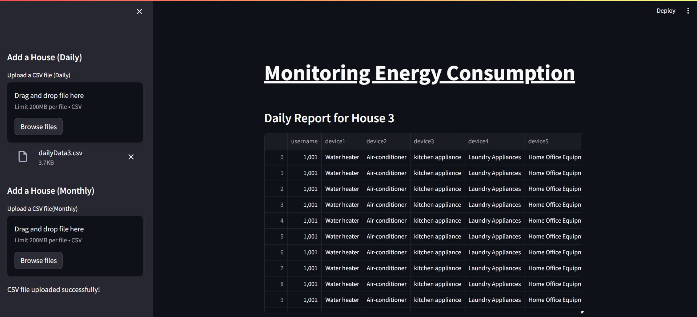
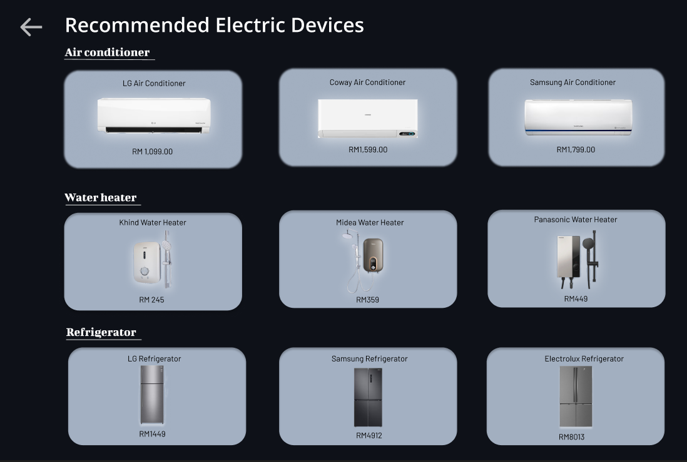
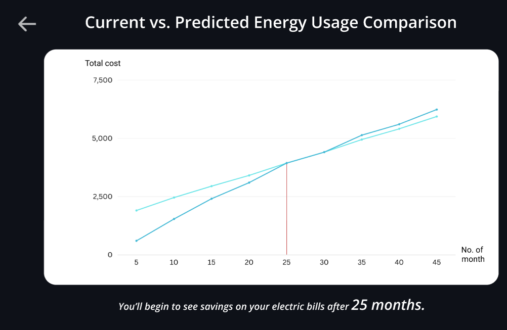
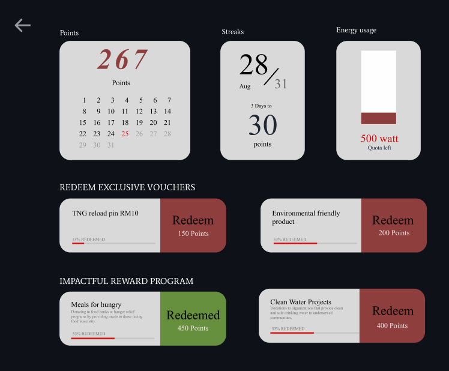

# DELL Hack2Hire Hackathon 2023
Hack2Hire is a holistic hiring process that observes student's problem solving skills, teamwork, and solution articulation. It's a unique platform for students to accelerate their learning and prepare for real industry problems.


## JimatLah by NoAnswer

JimatLah is a web application powered by __StreamLit__ with many functions to targets to reduce **climate action**.


#### Why StreamLit :
    - Simplicity and User-Friendly  
    - Mobile-responsiveness thanks to Streamlit's Responsiveness
    - Many libraries to integrate rich data visualizations
    - Free and easy deployment using StreamLit's community cloud and GitHub

### What features do we offer?
- __Daily Report and Monthly Report__
    - Power consumption of each category of electronic devices by hourly usage for daily report
    - For monthly report, we do give details of total usage for the month and also recommendation based on your usage.
    E.g: If your power usage of aircon is too high, the app will give you insight and recommendation how to reduce it, and if it's in an acceptable range, there won't be any issue
    
    
    - Extra feature in this page:
        - View daily & monthly report of other house
        - Add new houses (dataset) to view their report as well
        
    

- __Articles / Tips & Trick__
    - General information
    - Tips and tricks on how to reduce climate action

- __Recommendation for electronic devices__
    - Compare electronic devices in details including the rating for saving energy, the price, the brand, the warranty and the source of comparison
    - Recommends users energy-saving brands to save more money in the long run   
       
     

- __Reward System__
    - By saving money and energy in their household, they can get points in return.
    - With points, users can use it to redeem tokens, vouchers or event contribute in planting trees or helping world-problems   
         


#### Note: Only functional coded parts are article/tips and the dashboard page, the rest are implemented **ONLY** using Figma.  


## How to run the application?
- Install Streamlit and Required Dependencies
    - Type in console:
    ```
    pip install streamlit
    ```
- Download required libraries
- Run the app
    ``` 
    streamlit run (app_name)
    *in this case it's Home.py
    ```

- Or use VSCode from Anaconda to run it easier


